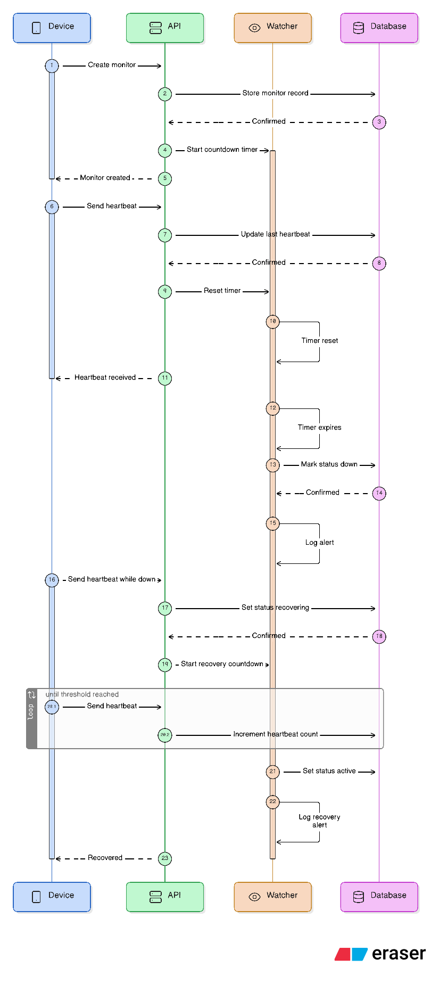
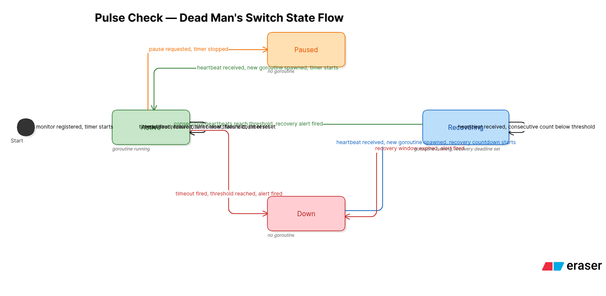

# Pulse Check API

A Dead Man's Switch API for monitoring remote devices in critical infrastructure environments. Devices register a monitor with a countdown timer and must send periodic heartbeats to confirm they are alive. If a device fails to check in before its timer expires, the system automatically fires an alert.

Built for CritMon Servers Inc. to monitor solar farms and unmanned weather stations in areas with poor connectivity.

---

## Architecture

### Sequence Diagram

### State Flowchart

---

## Setup Instructions

Coming soon.

---

## API Documentation

Coming soon.

---

## Developer's Choice Feature

Coming soon.
